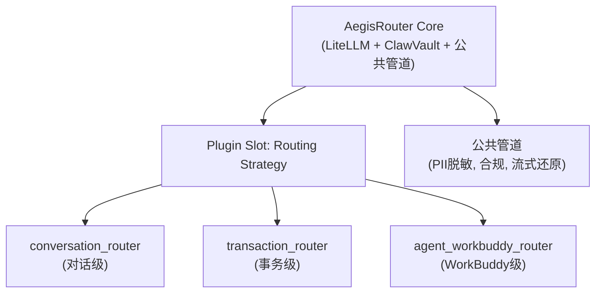
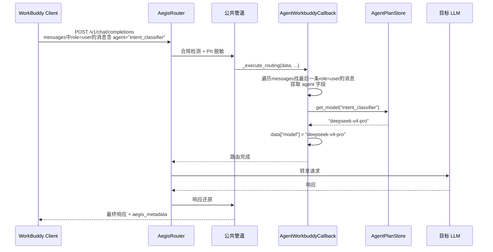
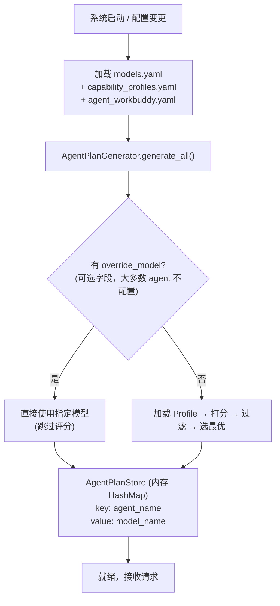
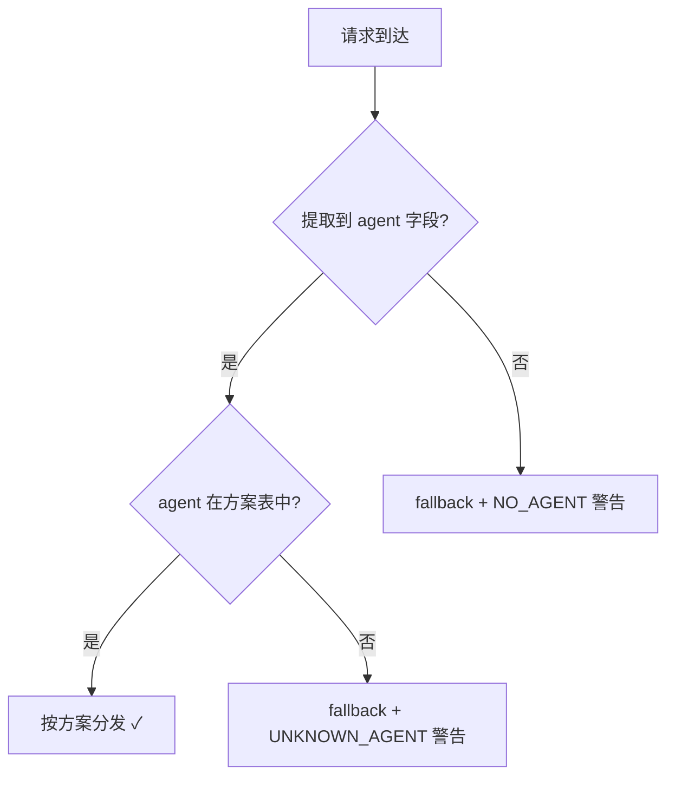

# AegisRouter Agent-WorkBuddy 路由插件 — 技术设计文档

## Overview

Agent-WorkBuddy 是 AegisRouter 的第三个路由插件，专为 WorkBuddy 客户端设计。WorkBuddy 同样是多 Agent 协同场景（与事务级路由一致），但其客户端无法在请求 metadata 中发送 `template` 字段，因此不能使用事务级路由（Transaction Router）的 `(template, agent)` 二元组查表方式。

Agent-WorkBuddy 插件采用**单维度路由**策略：仅以 `agent` 名称作为查表 key，从预计算方案中查找该 agent 的目标模型。不关心业务流程/模板编排，只看当前请求是哪个 Agent 发出的。配置文件中不再需要 template 分组，直接列出 agent 与其 capability_profile 的对应关系即可。

**核心架构决策**：
- 路由 key 从二维 `(template, agent)` 简化为一维 `agent`
- Agent 标识从 `role: "user"` 消息的 `agent` 字段提取（非 metadata）
- 复用已有的 `CapabilityProfileManager`、`TemplatePlanGenerator` 的评分逻辑
- 复用 `models.yaml` 和 `capability_profiles.yaml`，独立配置文件为 `agent_workbuddy.yaml`

**三种路由插件对比**：

| 维度 | conversation（对话级） | transaction（事务级） | agent_workbuddy |
|------|----------------------|----------------------|-----------------|
| 路由粒度 | 单次请求实时打分 | template × agent | agent |
| 路由 key | 无预计算 key | `(template, agent)` | `agent` |
| 决策时机 | 每次请求实时 | 启动时预计算 | 启动时预计算 |
| 上下文来源 | 消息内容分析 | metadata.transaction | message.agent 字段 |
| 分发延迟 | ~10ms | < 0.1ms | < 0.1ms |
| 适用场景 | 独立对话 | 多 Agent 协作流程 | WorkBuddy 客户端多 agent协作流程 |

---

## Architecture

### 插件化架构



### 请求调用链路



### 方案预计算流程



---

## Components and Interfaces

### 1. AgentWorkbuddyCallback (路由插件主入口)

```python
class AgentWorkbuddyCallback(BaseRouterCallback):
    """Agent-WorkBuddy 路由插件 — 单维度查表分发。

    启动时由 AgentPlanGenerator 预计算方案表，
    分发时纯内存查表 agent → model，延迟 < 0.1ms。
    """

    def __init__(
        self,
        plan_store: AgentPlanStore,
        fallback_model: str,
        failover_chains: dict[str, list[str]] | None = None,
        failover_enabled: bool = True,
        pool: ClawVaultPool | None = None,
        degradation_manager: DegradationManager | None = None,
        config_dir: str | None = None,
    ) -> None: ...

    async def _execute_routing(
        self, data: dict, masked_text: str, original_text: str, prompt_hash: str
    ) -> None:
        """执行 agent-workbuddy 路由：提取 agent → 查表 → 设 model。"""
        ...
```

**职责**：
- 从请求 messages 中找到最后一条 `role: "user"` 的消息，读取其 `agent` 字段
- 查 `AgentPlanStore` 获得目标模型
- 设置 `data["model"]` 完成路由
- 集成 failover 链机制

**Agent 字段提取伪代码**：
```python
def _extract_agent(self, data: dict) -> Optional[str]:
    messages = data.get("messages", [])
    # 逆序遍历，找最后一条 role=user 的消息
    for msg in reversed(messages):
        if isinstance(msg, dict) and msg.get("role") == "user":
            agent = msg.get("agent")
            if agent:
                return agent
    # 备选：metadata.agent
    metadata = data.get("metadata") or {}
    return metadata.get("agent")
```

### 2. AgentPlanStore (单维度内存查找表)

```python
class AgentPlanStore:
    """单维度查找表：agent_name → model_name。

    与 RoutingPlanStore 类似，但 key 从二元组简化为单一字符串。
    """

    def set_model(self, agent: str, model: str) -> None: ...
    def get_model(self, agent: str) -> Optional[str]: ...
    def get_all_plans(self) -> dict[str, str]: ...
    def __len__(self) -> int: ...
    def __contains__(self, agent: str) -> bool: ...
```

**职责**：
- 存储 `agent → model` 映射
- 纯内存查表，线程安全
- 通过引用替换实现原子更新

### 3. AgentPlanGenerator (方案生成器)

```python
class AgentPlanGenerator:
    """纯函数：输入 agent_workbuddy.yaml 配置 → 输出 AgentPlanStore。

    复用 CapabilityProfileManager 的评分和约束过滤逻辑。
    """

    def __init__(
        self,
        profile_manager: CapabilityProfileManager,
        models: list[dict[str, Any]],
        fallback_model: str,
    ) -> None: ...

    def generate_all(self, agents: list[AgentDef]) -> AgentPlanStore:
        """为所有 Agent 生成模型分配方案。"""
        ...
```

**职责**：
- 遍历 agent 列表，使用 `CapabilityProfileManager.select_best_model()` 为每个 agent 选择最优模型
- override_model 优先级最高
- 返回填充完成的 `AgentPlanStore`

### 4. CapabilityProfileManager (复用)

完全复用现有实现，无需修改。评分逻辑、约束过滤、偏好选择机制一致。

### 5. plugin_loader.py (注册扩展)

```python
# 新增注册条目
SUPPORTED_PLUGINS: dict[str, tuple[str, str]] = {
    "conversation": ("aegis_router.callbacks.smart_router", "SmartRouterCallback"),
    "transaction": ("aegis_router.callbacks.transaction_router", "TransactionRouterCallback"),
    "agent_workbuddy": ("aegis_router.callbacks.agent_workbuddy_router", "AgentWorkbuddyCallback"),
}
```

新增 `_initialize_agent_workbuddy_plugin()` 函数，模式与 `_initialize_transaction_plugin()` 一致。

---

## Data Models

### 核心数据结构

```python
@dataclass
class AgentWorkbuddyDef:
    """agent_workbuddy.yaml 中的 Agent 定义"""
    name: str                              # Agent 唯一标识
    capability_profile: str                # Profile 名称
    override_model: Optional[str] = None   # 可选：管理员直接指定模型，跳过自动评分
    description: Optional[str] = None      # Agent 描述（文档用）
```

### 配置文件格式

#### config/agent_workbuddy.yaml

```yaml
# =============================================================================
# AegisRouter Agent-WorkBuddy 路由 — Agent 模型分配配置文件
# =============================================================================
#
# 本文件定义 WorkBuddy 客户端使用的 Agent 列表及其能力 Profile。
# 系统启动时为每个 Agent 预计算最优模型分配，之后请求直接查表分发。
#
# 与 transaction_templates.yaml 的区别：
#   - 无 template 层级，agent 是唯一的路由维度
#   - agent 名称全局唯一（不按模板分组）
#   - 查表 key: agent_name → model_name（单维度）
#
# === 字段说明 ===
#
# agents:                   顶层字段，包含所有 Agent 定义
#   - name:                 Agent 唯一标识（全局唯一，用作查表 key）
#     capability_profile:   能力 Profile 名称（必填）
#     override_model:       模型覆盖（可选，跳过自动评分直接指定模型）
#     description:          Agent 描述（可选，仅文档用）
#
# =============================================================================

agents:
  - name: intent_classifier
    capability_profile: lightweight
    description: "意图分类 Agent — 负责识别用户输入意图"

  - name: document_parser
    capability_profile: long_context
    description: "文档解析 Agent — 处理长文本文档"

  - name: reasoning_engine
    capability_profile: strong_reasoning
    description: "推理引擎 Agent — 复杂逻辑分析"

  - name: code_assistant
    capability_profile: code_specialist
    description: "代码助手 Agent — 代码生成与审查"

  - name: general_assistant
    capability_profile: medium
    description: "通用助手 Agent — 一般性对话"

  - name: heavy_analyst
    capability_profile: heavy
    description: "重度分析 Agent — 最复杂的推理任务"
    override_model: gpt-5.6-sol            # 可选：跳过评分，强制使用指定模型
```

### 请求格式

WorkBuddy 客户端也是多 Agent 协同场景，但客户端无法在 metadata 中传递 template 字段。
因此仅以 agent 为维度路由，不关心业务流程/模板编排。

`agent` 字段**仅存在于 `role: "user"` 的消息中**，标识当前发送请求的 Agent。

```jsonc
{
  "model": "any",
  "messages": [
    {
      "role": "system",
      "content": "你是一个意图分类助手"
    },
    {
      "role": "user",
      "content": "<user_query>[TEMPLATE=resume_screening] ...实际prompt...</user_query>",
      "agent": "intent_classifier"    // 仅 role=user 的消息有此字段
    }
  ],
  "metadata": {
    // WorkBuddy 不发送 transaction 字段
    // 可能包含其他通用字段如 session_id, request_id 等
  }
}
```

**Agent 字段提取规则**：
1. 遍历 `messages`，找到最后一条 `role: "user"` 的消息，读取其 `agent` 字段
2. 若 user 消息中无 `agent` 字段，尝试 `metadata.agent`（备选兼容）
3. 均无 → 使用 fallback 模型 + NO_AGENT 警告

### 响应格式

```jsonc
{
  "choices": [...],
  "aegis_metadata": {
    "template": "",
    "agent": "intent_classifier",
    "assigned_model": "deepseek-v4-pro",
    "routing_plugin": "agent_workbuddy",
    "warnings": []
  }
}
```

---

## 方案生成示例

### 系统启动日志

```
[INFO] Agent-WorkBuddy Router: 方案生成完成

  Agent                → Model              (Profile)
  ───────────────────────────────────────────────────
  intent_classifier    → deepseek-v4-pro    (lightweight, score=0.89)
  document_parser      → gpt-5.5           (long_context, score=0.81)
  reasoning_engine     → gpt-5.5           (strong_reasoning, score=0.85)
  code_assistant       → codex-mini        (code_specialist, score=0.82, preferred)
  general_assistant    → deepseek-v4-pro    (medium, score=0.71)
  heavy_analyst        → gpt-5.6-sol       (override, 管理员指定)

  Total: 6 agents, Fallback: deepseek-v3
```

### 配置变更日志

```
[INFO] 检测到 agent_workbuddy.yaml 变更，重算方案...

  变化:
    reasoning_engine: gpt-5.5 → gpt-5.2  (新模型评分更高)
    其他 Agent 不变
```

---

## Error Handling

| 场景 | 行为 |
|------|------|
| 请求中无 agent 字段 | 使用 fallback 模型 + NO_AGENT 警告日志 |
| Agent 不在方案表中 | 使用 fallback 模型 + UNKNOWN_AGENT 警告日志 |
| Profile 不存在 | 降级 medium + PROFILE_NOT_FOUND 警告 |
| 无模型满足约束 | fallback 模型 + NO_CANDIDATE 警告 |
| agent_workbuddy.yaml 不存在 | 正常启动，方案表为空，所有请求走 fallback |
| agent_workbuddy.yaml 语法错误 | 拒绝加载，保持上一版方案 + CONFIG_ERROR |
| LLM 调用失败 | failover 链重试（仅当次请求） |
| agent 名称重复 | 最后定义覆盖前面的（启动时 DUPLICATE_AGENT 警告） |

### 降级链路



---

## Integration with plugin_loader.py

### 注册

在 `SUPPORTED_PLUGINS` 字典中新增条目：

```python
"agent_workbuddy": (
    "aegis_router.callbacks.agent_workbuddy_router",
    "AgentWorkbuddyCallback",
),
```

### 初始化函数

新增 `_initialize_agent_workbuddy_plugin()`:

```python
def _initialize_agent_workbuddy_plugin(config_dir: Path, **kwargs) -> BaseRouterCallback:
    """初始化 Agent-WorkBuddy 路由插件。

    加载流程:
    1. load_config() 加载 AegisConfig（models + route_config）
    2. 创建 CapabilityProfileManager
    3. 加载 agent_workbuddy.yaml
    4. 转换模型数据为 dict 格式
    5. AgentPlanGenerator.generate_all()
    6. 构造 AgentWorkbuddyCallback 实例
    7. 启动 ConfigWatcher 热更新
    """
    ...
```

### 配置激活

在 `config/config.yaml` 中切换:

```yaml
routing_plugin: agent_workbuddy
```

---

## Testing Strategy

### 单元测试

| 组件 | 测试重点 |
|------|---------|
| AgentPlanGenerator | 方案生成、override 优先、约束过滤、重复 agent 处理 |
| AgentPlanStore | 单维度查表、原子替换 |
| AgentWorkbuddyCallback | agent 字段提取、分发正确性、fallback 路径、异常处理 |
| Agent 字段提取 | 最后一条role=user消息的agent字段、metadata.agent备选、缺失场景、多条user消息场景 |

### 集成测试

- 启动 → 方案生成 → 请求分发 → 验证模型正确
- 配置热更新 → 方案自动重算
- 插件切换 → `transaction` ↔ `agent_workbuddy` 无副作用
- Failover → LLM 错误时重试不影响全局方案
- WorkBuddy 请求格式兼容性

### 性能基准

| 指标 | 目标 |
|------|------|
| 请求分发延迟 | < 0.1ms |
| 方案生成 (20 agents) | < 2ms |
| 内存 | < 5KB |

---

## Performance Considerations

- **AgentPlanStore** 使用 `dict[str, str]` 单键查找，比 RoutingPlanStore 的二元组查找更快（O(1) 哈希查找）
- 方案预计算在启动时一次性完成，运行时零计算开销
- 配置热更新时整体重建新 store 后原子替换引用，无锁竞争
- 内存占用极低：每个 agent 条目 ~200 bytes

---

## Security Considerations

- `agent` 字段仅用于路由查表，不进入日志中的敏感数据
- Agent 名称验证：仅接受 `[a-zA-Z0-9_-]` 字符，防止注入
- Override model 值必须在 `models.yaml` 中已定义
- Failover 链不修改全局方案表，保证隔离性

---

## Dependencies

- **复用现有组件**：`CapabilityProfileManager`、`BaseRouterCallback`、`ClawVaultPool`、`DegradationManager`、`AuditLogger`、`ConfigWatcher`
- **复用配置文件**：`models.yaml`、`capability_profiles.yaml`、`config.yaml`
- **新增文件**：
  - `aegis_router/callbacks/agent_workbuddy_router.py` — 插件实现
  - `aegis_router/router/agent_plan_store.py` — 单维度方案表
  - `aegis_router/router/agent_plan_generator.py` — 方案生成器
  - `config/agent_workbuddy.yaml` — Agent 配置

---

## Correctness Properties

*A property is a characteristic or behavior that should hold true across all valid executions of a system—essentially, a formal statement about what the system should do. Properties serve as the bridge between human-readable specifications and machine-verifiable correctness guarantees.*

### Property 1: Agent 标识提取正确性

*For any* messages array containing one or more `role: "user"` messages with `agent` fields, the extracted agent identifier SHALL always equal the `agent` field of the last `role: "user"` message in the array.

**Validates: Requirements 1.1, 1.2**

### Property 2: Metadata 备选提取

*For any* request where no `role: "user"` message contains an `agent` field but `metadata.agent` is present, the extracted agent identifier SHALL equal the value of `metadata.agent`.

**Validates: Requirements 1.3**

### Property 3: Agent 名称验证

*For any* string, if the string matches the pattern `[a-zA-Z0-9_-]+` it SHALL be accepted as a valid agent identifier; if it contains any character outside that set, it SHALL be rejected and the request SHALL route to the fallback model.

**Validates: Requirements 1.5, 1.6**

### Property 4: Override 优先级

*For any* agent definition with an `override_model` field set, the AgentPlanGenerator SHALL assign exactly that model regardless of the CapabilityProfileManager scoring result.

**Validates: Requirements 2.2**

### Property 5: 评分选择一致性

*For any* agent definition without `override_model`, the assigned model in the AgentPlanStore SHALL equal the model returned by `CapabilityProfileManager.select_best_model()` for that agent's capability_profile.

**Validates: Requirements 2.3**

### Property 6: 重复 Agent 最后定义胜出

*For any* agent list containing duplicate agent names, the AgentPlanStore SHALL contain only the assignment corresponding to the last definition of each duplicated name, and the store SHALL have exactly as many entries as there are unique agent names.

**Validates: Requirements 2.6, 7.4**

### Property 7: 确定性

*For any* valid set of configuration inputs (`agent_workbuddy.yaml`, `models.yaml`, `capability_profiles.yaml`), invoking `AgentPlanGenerator.generate_all()` multiple times SHALL produce identical AgentPlanStore contents.

**Validates: Requirements 7.2**

### Property 8: 一致性与原子更新

*For any* AgentPlanStore instance that has not been replaced, all concurrent lookups for the same agent name SHALL return the same model. During replacement, no request SHALL observe a partially-updated plan (all mappings are either fully old or fully new).

**Validates: Requirements 7.3, 4.2**

### Property 9: 已知 Agent 正确路由

*For any* request with a valid agent identifier that exists in the AgentPlanStore, the Agent_WorkBuddy_Plugin SHALL set `data["model"]` to exactly the value stored in the plan store for that agent.

**Validates: Requirements 3.1**

### Property 10: 未知/缺失 Agent 兜底路由

*For any* request where the agent identifier is missing, invalid, or not present in the AgentPlanStore, the Agent_WorkBuddy_Plugin SHALL route to the configured fallback model.

**Validates: Requirements 1.4, 3.2**

### Property 11: Failover 隔离

*For any* failover event triggered by an LLM call failure, the AgentPlanStore SHALL remain unchanged after the failover completes—the stored agent → model mapping is identical before and after.

**Validates: Requirements 5.1, 5.2**

### Property 12: Failover 链遍历

*For any* request where the primary model fails and a failover chain is configured, the Agent_WorkBuddy_Plugin SHALL attempt models in the chain in order until one succeeds or all are exhausted.

**Validates: Requirements 5.1**

### Property 13: Failover 禁用

*While* failover is disabled in configuration, *for any* request where the primary model fails, the Agent_WorkBuddy_Plugin SHALL not attempt alternative models.

**Validates: Requirements 5.3**

### Property 14: 插件互斥

*While* `routing_plugin` is set to `agent_workbuddy`, the active plugin type SHALL be `agent_workbuddy` and no other routing plugin (conversation, transaction) SHALL participate in routing decisions.

**Validates: Requirements 6.2**

---

## 项目工程结构变更

```
aegis_router/
├── callbacks/
│   ├── __init__.py
│   ├── base_router.py                  # 不变: 插件基类
│   ├── smart_router.py                 # 不变: 对话级
│   ├── transaction_router.py           # 不变: 事务级
│   ├── agent_workbuddy_router.py       # 新增: WorkBuddy 级
│   ├── plugin_loader.py                # 修改: 注册第三个插件
│   ├── stream_rehydrator.py            # 不变
│   ├── degradation.py                  # 不变
│   └── uds_pool.py                     # 不变
├── router/
│   ├── __init__.py
│   ├── capability_profiles.py          # 不变（复用）
│   ├── config_watcher.py              # 修改: 新增监听 agent_workbuddy.yaml
│   ├── template_plan_generator.py     # 不变
│   ├── routing_plan_store.py          # 不变
│   ├── agent_plan_store.py            # 新增: 单维度方案表
│   ├── agent_plan_generator.py        # 新增: Agent 方案生成器
│   └── ...

config/
├── config.yaml                         # 修改: routing_plugin 新增 agent_workbuddy 可选值
├── capability_profiles.yaml            # 不变（共享）
├── models.yaml                         # 不变（共享）
├── transaction_templates.yaml          # 不变
├── agent_workbuddy.yaml                # 新增: Agent 列表配置
└── ...
```
